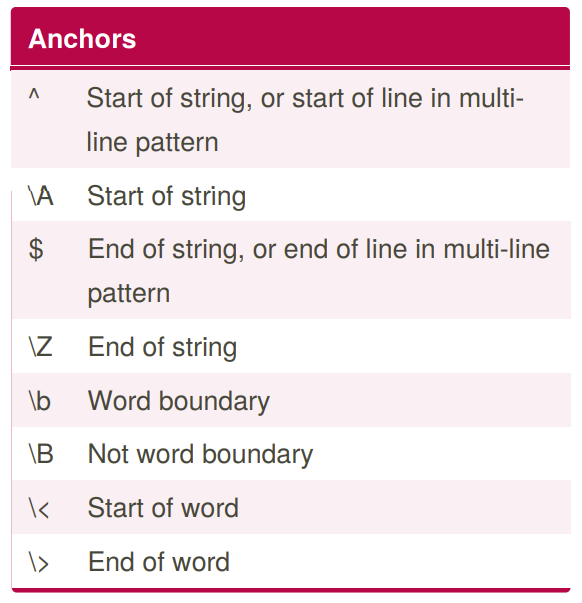
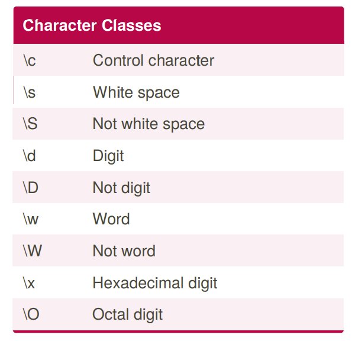
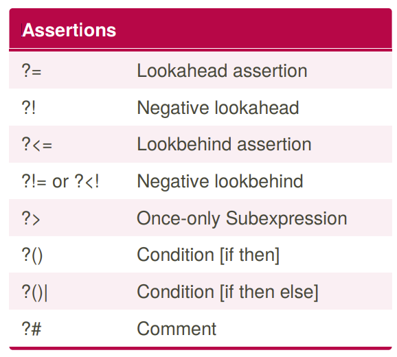
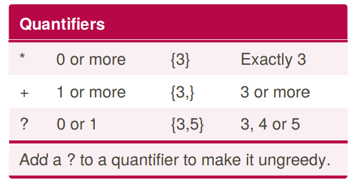
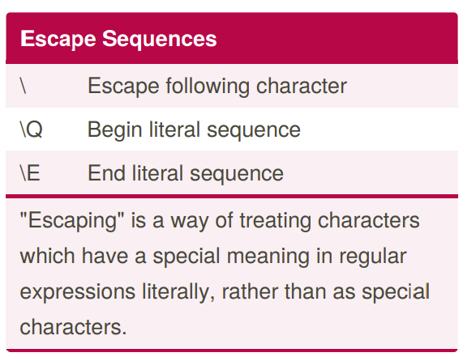
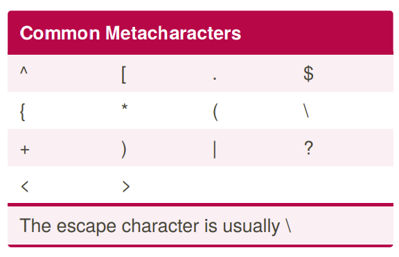
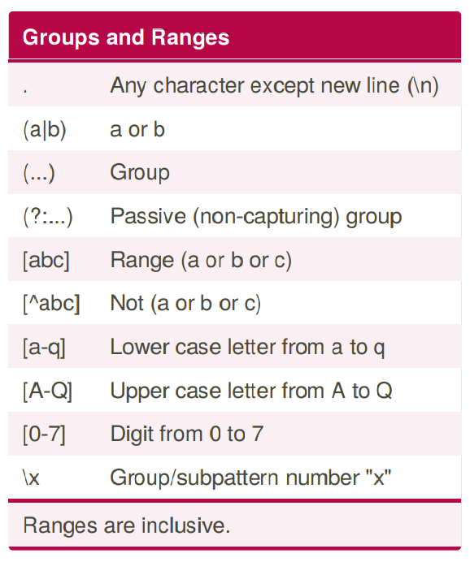
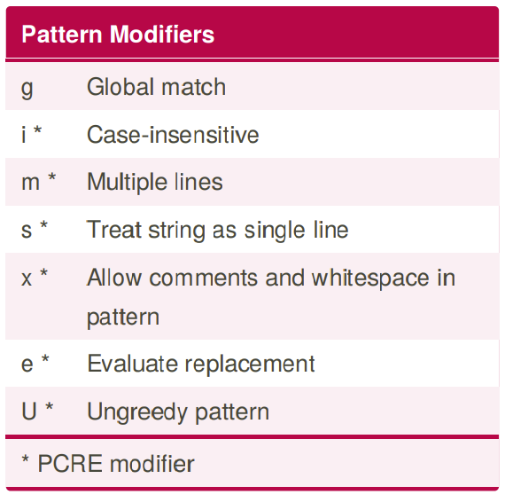
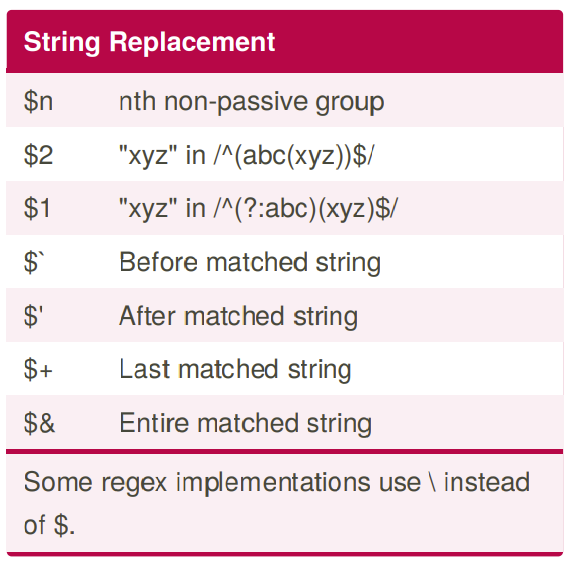

# [Regex Cheat Sheet](https://www.rexegg.com/regex-quickstart.html)

A quick reference guide for regular expressions (regex), including symbols, ranges, grouping, assertions and some sample patterns to get you started.

### Anchors

### Character Classes

### Assertions

### Quanti­fiers

### Escape Sequences

### Common Metach­ara­cters

##### The escape character is usually \

### Groups and Ranges

### Pattern Modifiers (flags)

### String Replac­ement

