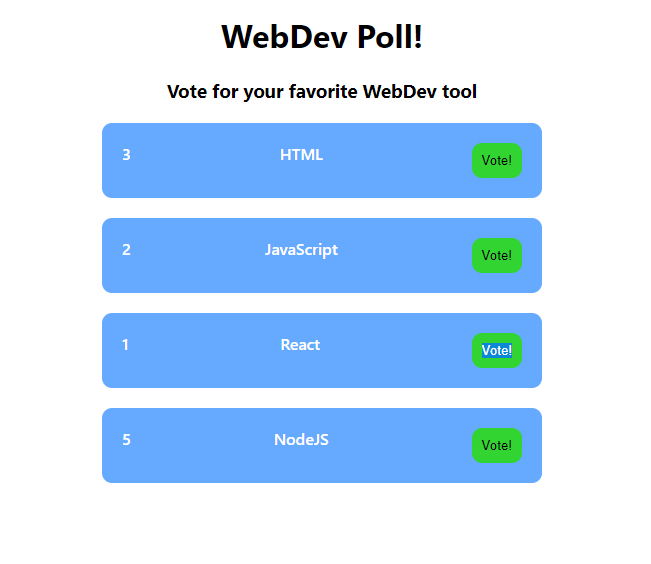

# Poll Web App
The main task for this exercise is to create a small application for you to practice what you have learned in the course. The concept for this web app is to create a small poll where people can vote for their favorite web dev tool. For reference you can look at the image.

## Instructions
- Create the base structure of the small web app. How many components do you think are needed? Use functional components for it.
- Use hooks to handle the counter for each of the web dev tools. Every time the user clicks on a button the corresponding counter should increase by 1.

## Extra
- In the header show which tool has more votes.

## Notes
- You can use the provided css so you don't need to worry about that.